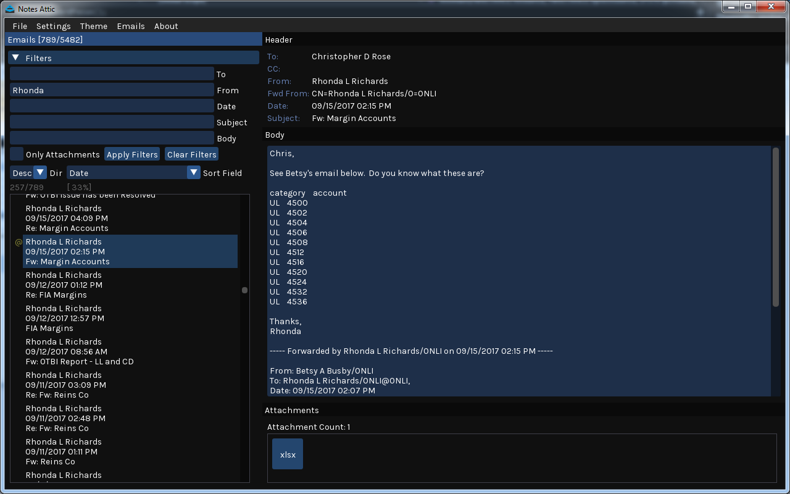

# Notes Attic

```
Viewer and Secondary Storage for Lotus Notes Emails
2018.01.25
Chris Rose [czr]
```



## Intro

Hey, Thanks for downloading Notes Attic. I hope you like it!

If this is your first time using the program, just open up "notes_attic.exe".
You probably won't see any emails when you first open it up - That's because you
have to download your current emails from IBM Notes first. The default directory 
where the emails will be exported is C:\email_archive. You can change this if you like
by going to the menu: 

    [*] Settings > Edit Settings ...  And then modifying the "Email Root Dir".

After that, you can export your emails by going to the menu:

    [*] Emails > Manually Download Emails

It should run the "exportnotes.exe" command-line program that comes with the download.
Type in your password for IBM Notes, then it should begin downloading your emails and attachments to the "root_dir".

Once it's finished you should be able to click around and see some emails, filter your emails, and be able to view attachments.

*Note: When exporting emails, it will try to export all of your emails. If the email has already been exported,
it will not export it again. This will prevent duplicates and allow your email archive to grow without issue.

## Automatic Downloading of Emails

You can enable automatic download of emails from the menu:

    [*] Emails > Automatically Download Emails > Enable Downloading

You can specify if you want to download your emails Hourly, Daily, Weekly, or Monthly.

## Fonts

These fonts are included with Notes Attic.They should be included in a fonts\ folder in the application directory.

- Inconsolata.ttf
- Karla.ttf
- PT_Sans.ttf
- Ubuntu.ttf

If a font is not found it is not loaded. If none of the fonts are found, it will use the default embedded font.

## Email List Controls

| Control | Desc |
|---------|------|
| Mouse LMB  | Select an email |
| Mouse RMB  | Open context menu for an email |
| Mouse Wheel| Move scrollbar |
| UP ARROW   | Navigate to previous email in list |
| DOWN ARROW | Navigate to next email in list |
| PAGE UP    | Jump 10 emails down the list |
| PAGE DOWN  | Jump 10 emails up the list |
| HOME       | Go To First email in list |
| END        | Go To Last email in list |
